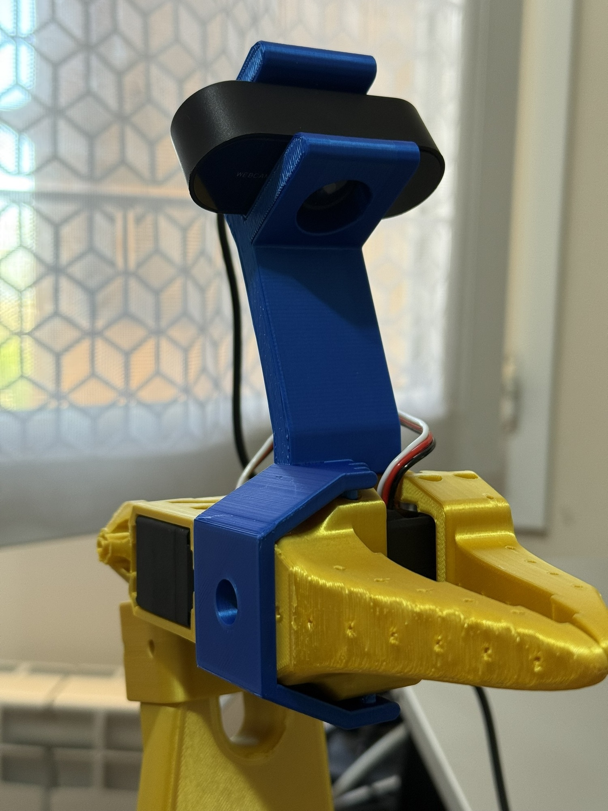

# so-arm100-extra
Extra parts for the SO-ARM100 cheap robotic arm

This extra piece allows you to install a Vinmooog camera on your SO-ARM100 robot without any screw. It's easy to install and remove. It's designed to strongly stay in place.

Printed with grid support and 15% fill.

